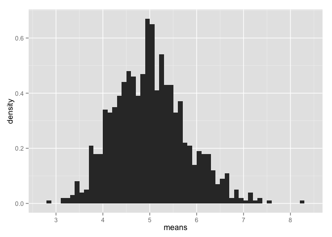

Tom Lous  
2 Feb 2015  

# Statistical Inference Course Project

## Overview
In this project I will investigate the exponential distribution in R and compare it with the Central Limit Theorem. The exponential distribution can be simulated in R with rexp(n, lambda) where lambda is the rate parameter. The mean of exponential distribution is 1/lambda and the standard deviation is also 1/lambda. I will set lambda = 0.2 for all of the simulations. I will investigate the distribution of averages of 40 exponentials. Note that I will need to do a thousand simulations.

## Simulations


```r
# load neccesary libraries
library(ggplot2)

# set constants
λ <- 0.2# lambda for rexp
n <- 40 # number of exponetials
numberOfSimulations <- 1000 # number of tests

# set the seed to create reproducability
set.seed(19790811)

# run the test resulting in n x numberOfSimulations matrix
exponentialDistributions <- matrix(data=rexp(n * numberOfSimulations, λ), nrow=numberOfSimulations)
exponentialDistributionMeans <- data.frame(means=apply(exponentialDistributions, 1, mean))

# plot the means
ggplot(data = exponentialDistributionMeans, aes(x = means)) + 
  geom_histogram(binwidth=0.1, aes(y = ..density..)) + 
  #geom_density(colour="red", size=0.8, fill="red", alpha=0.1) +
  scale_x_continuous(breaks=round(seq(min(exponentialDistributionMeans$means), max(exponentialDistributionMeans$means), by=1)))
```

 

## Sample Mean versus Theoretical Mean

The expected mean $μ$ of a exponential distribution of rate $λ$ is 

$μ = \frac{1}{λ}$ 


```r
μ <- 1/λ
μ
```

```
## [1] 5
```

Let $\bar X$ be the average sample mean of 1000 simulations of 40 randomly sampled exponential distributions.


```r
meanOfMeans <- mean(exponentialDistributionMeans$means)
meanOfMeans
```

```
## [1] 5.010255
```

As you can see the expected mean and the avarage sample mean are very close 

```r
round(abs(meanOfMeans - μ), 3)
```

```
## [1] 0.01
```

## Sample Variance versus Theoretical Variance

The expected standard deviation $σ$ of a exponential distribution of rate $λ$ is 

$σ = \frac{\frac{1}{λ}}{\sqrt{n}}$ 


Let $Var_x$ be the variance of the average sample mean of 1000 simulations of 40 randomly sampled exponential distributions.


## Distribution
Illustrate via simulation and associated explanatory text the properties of the distribution of the mean of 40 exponentials.  You should
1. Show the sample mean and compare it to the theoretical mean of the distribution.
2. Show how variable the sample is (via variance) and compare it to the theoretical variance of the distribution.
3. Show that the distribution is approximately normal.
