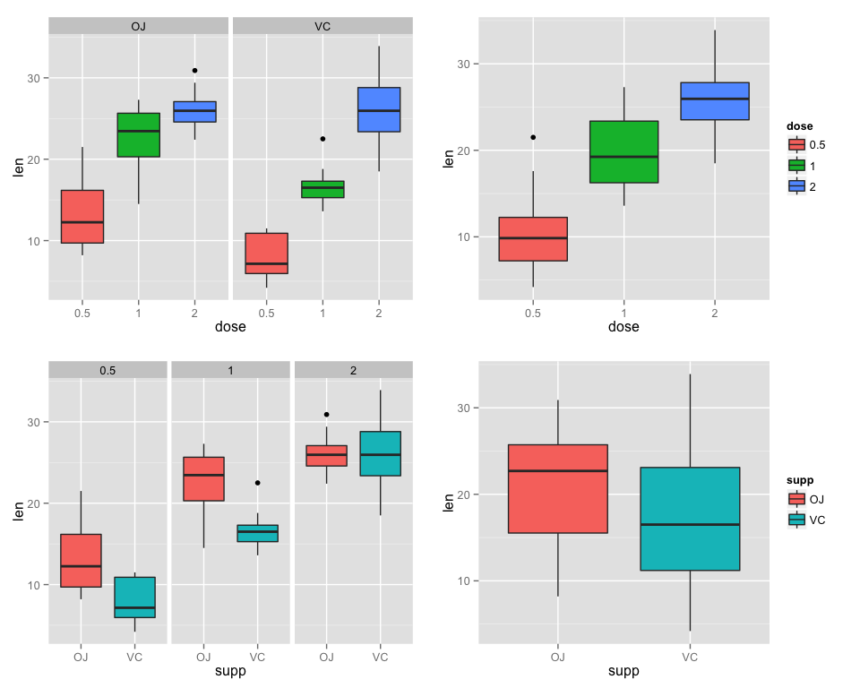

# Statistical Inference Course Project 2

## Overview
Load the ToothGrowth data and perform some basic exploratory data analyses 
- Provide a basic summary of the data.
- Use confidence intervals and/or hypothesis tests to compare tooth growth by supp and dose. (Only use the techniques from class, even if there's other approaches worth considering)
- State your conclusions and the assumptions needed for your conclusions. 


## Load Data


```r
# load neccesary libraries
library(ggplot2)
library(datasets)
library(gridExtra)
library(GGally)

# The Effect of Vitamin C on Tooth Growth in Guinea Pigs
data(ToothGrowth)
toothGrowth <- ToothGrowth 
toothGrowth$dose <- as.factor(toothGrowth$dose) # convert to factor
```


## Basic Summary of the data

```r
str(toothGrowth)
```

```
## 'data.frame':	60 obs. of  3 variables:
##  $ len : num  4.2 11.5 7.3 5.8 6.4 10 11.2 11.2 5.2 7 ...
##  $ supp: Factor w/ 2 levels "OJ","VC": 2 2 2 2 2 2 2 2 2 2 ...
##  $ dose: Factor w/ 3 levels "0.5","1","2": 1 1 1 1 1 1 1 1 1 1 ...
```

```r
summary(toothGrowth)
```

```
##       len        supp     dose   
##  Min.   : 4.20   OJ:30   0.5:20  
##  1st Qu.:13.07   VC:30   1  :20  
##  Median :19.25           2  :20  
##  Mean   :18.81                   
##  3rd Qu.:25.27                   
##  Max.   :33.90
```

```r
head(toothGrowth)
```

```
##    len supp dose
## 1  4.2   VC  0.5
## 2 11.5   VC  0.5
## 3  7.3   VC  0.5
## 4  5.8   VC  0.5
## 5  6.4   VC  0.5
## 6 10.0   VC  0.5
```

```r
table(toothGrowth$supp, toothGrowth$dose)
```

```
##     
##      0.5  1  2
##   OJ  10 10 10
##   VC  10 10 10
```
 

Do some analysis based on Analysis of Variance (ANOVA)

```r
anova.out <- aov(len ~ supp * dose, data=toothGrowth)
summary(anova.out)
```

```
##             Df Sum Sq Mean Sq F value   Pr(>F)    
## supp         1  205.4   205.4  15.572 0.000231 ***
## dose         2 2426.4  1213.2  92.000  < 2e-16 ***
## supp:dose    2  108.3    54.2   4.107 0.021860 *  
## Residuals   54  712.1    13.2                     
## ---
## Signif. codes:  0 '***' 0.001 '**' 0.01 '*' 0.05 '.' 0.1 ' ' 1
```

The results show there is a notable interaction between the length (len) and dosage (dose) (F(1,54)=15.572;p<0.01)
Also a very clear effect on length(len) by supplement type (supp) (F(2,54)=92;p<0.01). 
Last but not least there is a minor interaction between the combination of supplement type (supp) and dosage (dose) compared to the length (len) (F(2,54)=4.107;p<0.05).


```r
TukeyHSD(anova.out)
```

```
##   Tukey multiple comparisons of means
##     95% family-wise confidence level
## 
## Fit: aov(formula = len ~ supp * dose, data = toothGrowth)
## 
## $supp
##       diff       lwr       upr     p adj
## VC-OJ -3.7 -5.579828 -1.820172 0.0002312
## 
## $dose
##         diff       lwr       upr   p adj
## 1-0.5  9.130  6.362488 11.897512 0.0e+00
## 2-0.5 15.495 12.727488 18.262512 0.0e+00
## 2-1    6.365  3.597488  9.132512 2.7e-06
## 
## $`supp:dose`
##                diff        lwr        upr     p adj
## VC:0.5-OJ:0.5 -5.25 -10.048124 -0.4518762 0.0242521
## OJ:1-OJ:0.5    9.47   4.671876 14.2681238 0.0000046
## VC:1-OJ:0.5    3.54  -1.258124  8.3381238 0.2640208
## OJ:2-OJ:0.5   12.83   8.031876 17.6281238 0.0000000
## VC:2-OJ:0.5   12.91   8.111876 17.7081238 0.0000000
## OJ:1-VC:0.5   14.72   9.921876 19.5181238 0.0000000
## VC:1-VC:0.5    8.79   3.991876 13.5881238 0.0000210
## OJ:2-VC:0.5   18.08  13.281876 22.8781238 0.0000000
## VC:2-VC:0.5   18.16  13.361876 22.9581238 0.0000000
## VC:1-OJ:1     -5.93 -10.728124 -1.1318762 0.0073930
## OJ:2-OJ:1      3.36  -1.438124  8.1581238 0.3187361
## VC:2-OJ:1      3.44  -1.358124  8.2381238 0.2936430
## OJ:2-VC:1      9.29   4.491876 14.0881238 0.0000069
## VC:2-VC:1      9.37   4.571876 14.1681238 0.0000058
## VC:2-OJ:2      0.08  -4.718124  4.8781238 1.0000000
```

The Tukey HSD  analysis shows that there are significant differences between each of the groups in supp and dose
Only the interactions between VC:0.5-OJ:0.5; VC:1-OJ:0.5; OJ:2-OJ:1; VC:2-OJ:1 and VC:2-OJ:2  are not significant

```r
confint(anova.out)
```

```
##                   2.5 %    97.5 %
## (Intercept)  10.9276907 15.532309
## suppVC       -8.5059571 -1.994043
## dose1         6.2140429 12.725957
## dose2         9.5740429 16.085957
## suppVC:dose1 -5.2846186  3.924619
## suppVC:dose2  0.7253814  9.934619
```

```r
print(model.tables(anova.out,"means"),digits=3)
```

```
## Tables of means
## Grand mean
##          
## 18.81333 
## 
##  supp 
## supp
##    OJ    VC 
## 20.66 16.96 
## 
##  dose 
## dose
##   0.5     1     2 
## 10.60 19.73 26.10 
## 
##  supp:dose 
##     dose
## supp 0.5   1     2    
##   OJ 13.23 22.70 26.06
##   VC  7.98 16.77 26.14
```

## Conclusions

There are clear indications that both the supplement as the dosage have clear indipendent effects on the length of teeth guinea pigs. More those means on avarage longer teeth. Supplement type has a clear influence too, but OJ has a greater avarage teethgrowth in combination with dosages 0.5 and 1 then for the VC supplement, while teeth length for the VC supplement vs the OJ in combiantion with dosage 2 has no significant effect (almost same mean & same confidence interval)

The fact remains however that these assumpionts are based on the facts:

* that the guinea pigs are repesentative for the population of guinea pigs, 
* that dosage and supplement were randomly assigned and 
* that the distribution of the means is normal.
